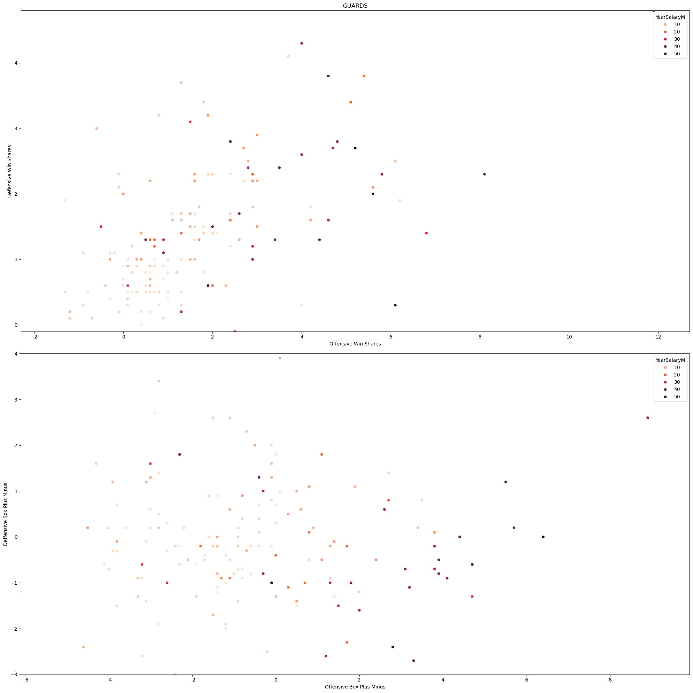

# NBA Player Value Analysis: Identifying Underpaid and Overpaid Players  🏀
## Overview
- Goals:
   - Determine which players offer teams the best "bang for your buck".
   - Finding trends between player types and salary
   - Visualize relationships between advanced metrics and salary (Win-Shares, Box Plus Minus, Player Efficency Rating, ect)
     
- This project analyzed NBA player performance and salary data from the 24-25 regular season to identify which players are considered overpaid or underpaid based on their on-court contributions in relation to their yearly salary. Using data analytics and machine learning, I was able to estimate a players value and eventually find players with significant differences between their salary and performance.
  
### Data Collection
- All data was aquired from https://www.basketball-reference.com/.
- Found 3 datasets: Per game statistics, Advanced Statistics, Player Contract data

### Technologies Used
- Python (Pandas, Numpy) - Data Cleaning and Manipulation
- Seaborn and Matplotlib - Data Visualization
- Scikit-learn - linear regression, feature standardization
- Jupyter Notebook - Writing Python scripts
- VSCode - Main IDE used

## MAIN QUESTIONS
   1) How are salaries distributed by position and player type?
   2) Which type of players (3-pt shooters, facilitators, defenders, ect) tend to be the most cost-efficient?
   3) Can we predict a players "true value" salary based on performance stats?
   4) Which players are considered underpaid/overpaid relative to their predicted salary?

## Methodology

### Data Cleaning and Preperation
- Removed duplicate (traded) players
- Filterd for Players who played at least half the season (41)
- Filterd salary data for 24-25 season
- Merged multiple CSVs (Per Game, Advanced, and Salary)

### EDA (Exploratory Data Analysis)
- Visualized salary distributions by position and player type
- Highlighted outliers and trends using scatter plots and histograms

### Positional Analysis
- Filtered Data by position to analyze salary trends
- Found insights into positional specialization in relation to salary

### Player Type Classification
- Groupted Players as Scorers, Shooters, Defenders, or Facilitators based on rules/stat thresholds
- Future extension: Use ML techniques (KMeans Clustering) for unsupervised classification

### ML Regression Model
- Trained a linear regression model using selected performance metrics
- Predicted each player's expected salary
- Calculated the "Value Gap" = Actual Salary − Predicted Salary

## Insights

### Part 1
Gaurds are more likely to contribute to the offensive side of the ball. This is seen in the larger salaries in players with higher offensive win shares. For example,
a player with 3 deffensive win shares are more likely to not be paid as much as a guard with 3+ offensive win shares. This shows the leagues desire for offensively talented gaurds. It is more common to see gaurds with high amounts of offensive win shares then deffensive win shares. The overall conclusion from these two graphs is that for gaurds, deffensive contributions are not as valued by teams. We can see that as the x values increase (Offensive metrics) there is a clear increase in salaries (darker points). This trend is not as clear for a increase in the y-axis (Defensive metrics). Additionally, there is less vertical spread, showing the trend for the league that gaurds are primarily valued for offensive contributions rather than defense possibly due to lack of size and interior prescence.

