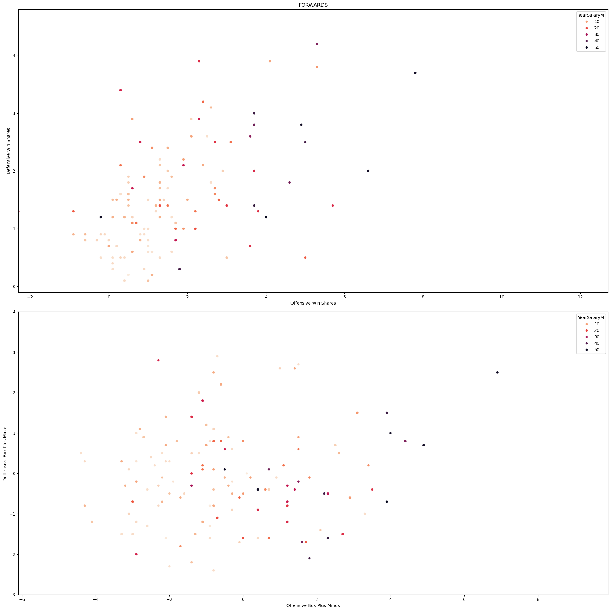
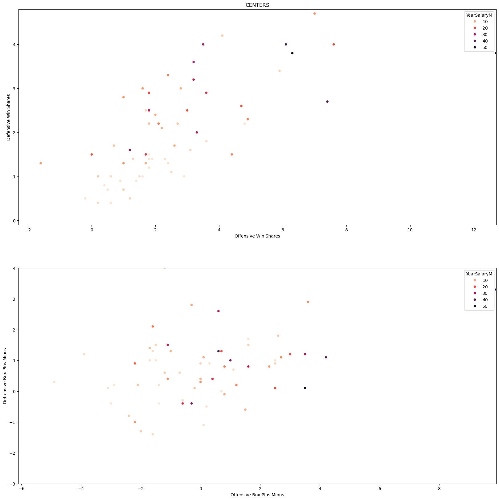
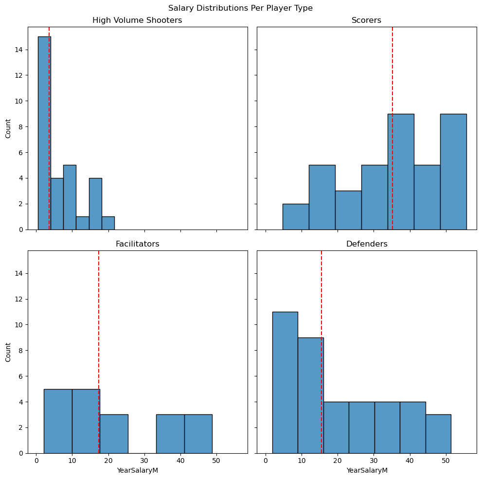
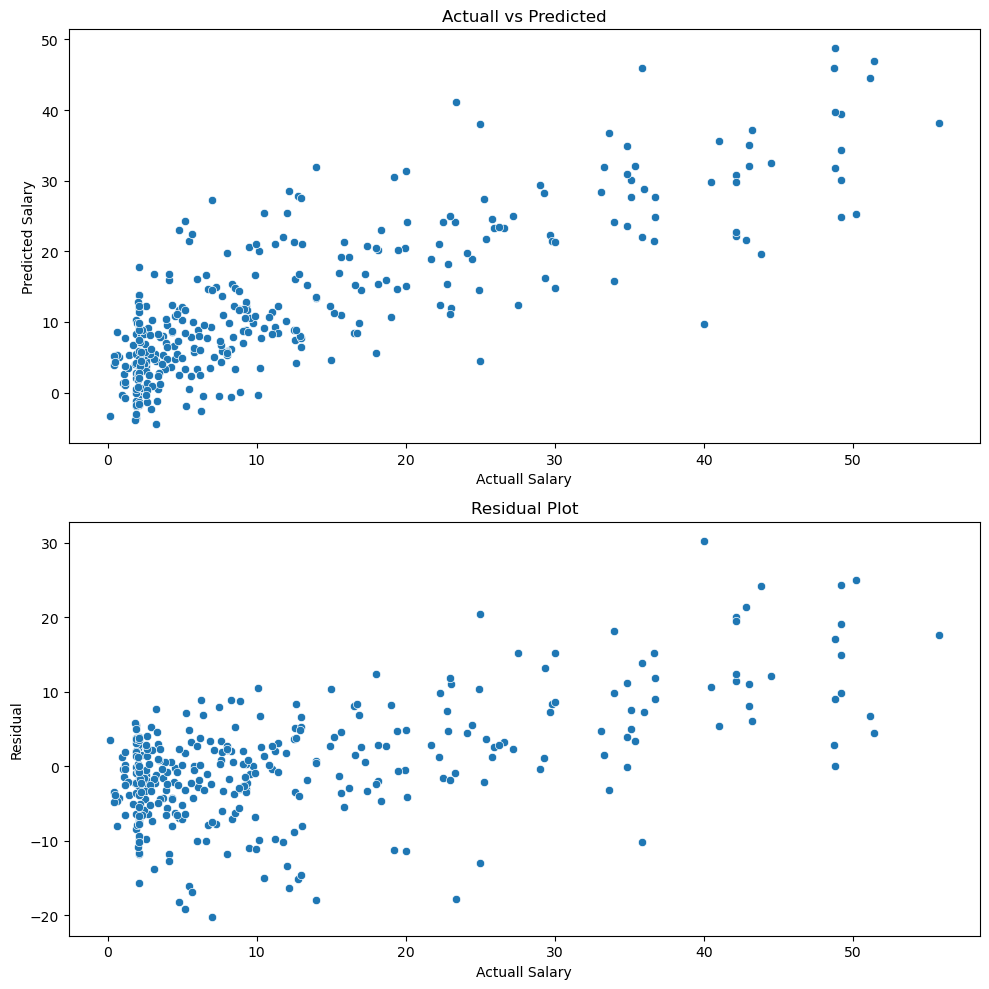

# NBA Player Value Analysis: Identifying Underpaid and Overpaid Players  🏀
## Overview
- Goals:
   - Determine which players offer teams the best "bang for your buck".
   - Finding trends between player types and salary
   - Visualize relationships between advanced metrics and salary (Win-Shares, Box Plus Minus, Player Efficency Rating, ect)
     
- This project analyzed NBA player performance and salary data from the 24-25 regular season to identify which players are considered overpaid or underpaid based on their on-court contributions in relation to their yearly salary. Using data analytics and machine learning, I was able to estimate a players value and eventually find players with significant differences between their salary and performance.
  
### Data Collection
- All data was aquired from https://www.basketball-reference.com/.
- Found 3 datasets: Per game statistics, Advanced Statistics, Player Contract data


### Technologies Used
- Python (Pandas, Numpy) - Data Cleaning and Manipulation
- Seaborn and Matplotlib - Data Visualization
- Scikit-learn - linear regression, feature standardization
- Jupyter Notebook - Writing Python scripts
- VSCode - Main IDE used


## MAIN QUESTIONS
   1) How are salaries distributed by position and player type?
   2) Which type of players (3-pt shooters, facilitators, defenders, ect) tend to be the most cost-efficient?
   3) Can we predict a players "true value" salary based on performance stats?
   4) Which players are considered underpaid/overpaid relative to their predicted salary?

## Methodology

### Data Cleaning and Preperation
- Removed duplicate (traded) players
- Filterd for Players who played at least half the season (41)
- Filterd salary data for 24-25 season
- Merged multiple CSVs (Per Game, Advanced, and Salary)

### EDA (Exploratory Data Analysis)
- Visualized salary distributions by position and player type
- Highlighted outliers and trends using scatter plots and histograms

### Positional Analysis
- Filtered Data by position to analyze salary trends
- Found insights into positional specialization in relation to salary

### Player Type Classification
- Groupted Players as Scorers, Shooters, Defenders, or Facilitators based on rules/stat thresholds
- Future extension: Use ML techniques (KMeans Clustering) for unsupervised classification

### ML Regression Model
- Trained a linear regression model using selected performance metrics
- Predicted each player's expected salary
- Calculated the "Value Gap" = Actual Salary − Predicted Salary

## Insights

### Part 1
- Gaurds are more likely to contribute to the offensive side of the ball. This is seen in the larger salaries in players with higher offensive win shares. For example, a player with 3 deffensive win shares are more likely to not be paid as much as a guard with 3+ offensive win shares. This shows the leagues desire for offensively talented gaurds. It is more common to see gaurds with high amounts of offensive win shares then deffensive win shares. The overall conclusion from these two graphs is that for gaurds, deffensive contributions are not as valued by teams. We can see that as the x values increase (Offensive metrics) there is a clear increase in salaries (darker points). This trend is not as clear for a increase in the y-axis (Defensive metrics). Additionally, there is less vertical spread, showing the trend for the league that gaurds are primarily valued for offensive contributions rather than defense possibly due to lack of size and interior prescence.


- A similar trend for Forwards follows from the trends of Gaurds. Teams look for offensive stars and are willing to pay more for those who can bring offensive win shares and contribute heavily to the offense side of the ball. Contrasting to the gaurds, there seems to be a larger spread of data, indicating that forwards are more versatile position, where some lean towards offense and some lean towards defense.




- Finally, the graphs of Centers seem to be unique to the other positional groupings. There is a much heavier emphasis on defense. Deffensive win shares seem to be paid more than offensive win shares for this position. Additionally, in the second graph, the points seem to be shifted up compared to the other positions. We can now see that as the y value increase (Defensive metrics) the salary increase. Additionally, many centers play power forward and many power forwards play center. This could account for some varying trends in the graphs of forwards and centers. This is because only one position is listed in the dataset, however players accumulate stats playing different positions.



- Overall, Gaurds are primarily paid for their offensive talents and facilitating an offence. Gaurds seem to be the opposite where they tend to be defensive anchors for their team while still presenting an strong interior prescence on the offense. Forwards are the most versatile position, they tend to lean towards the offense side of the ball, but can adapt to based on what a team needs.


### Part 2
- In this part, I analyzed player data and manually categorized players using stats thresholds. I created new individual dataframes for each player type by filtering the main dataframe based on the rules/stats thresholds. I then created graphs for each player type, where I compared the salary to one of three player evaluation statistics (WS, BPM, and PER).

   ```python
   PlayerDFShooters = PlayerDF[(PlayerDF['3PAr'] > 0.5) & (PlayerDF['3P%'] > 0.4)]
   PlayerDFScorers = PlayerDF[(PlayerDF['PTS'] > 20) & (PlayerDF['USG%'] > 25)]
   PlayerDFFacilitators = PlayerDF[(PlayerDF['AST'] > 5) & (PlayerDF['PTS'] < 20)]
   PlayerDFDefenders = PlayerDF[PlayerDF['STL'] + PlayerDF['BLK'] > 2]
   ```

- I first analyzed the salary distributions of each player type, highlighting the median salary for a reference point. The trends that followed were as expected. The "scorers" who were categorized as scoring more than 20 points and having a high usage rate had the highest median salary. Then followed the facilitators, who are less about scoring but rather creating offensive opportunities. Then comes the defenders and lastly specialized shooters. This trend makes sense as teams prioritize well rounded offensive players, where defense is less of a priority and there is a smaller market for specialized shooters.




- I then analyzed the relationship between salary and each statistic for every player type. Here I only include the WS graphs as the trends are quite similar between WS, BPM, and PER. Shooters tend to have the smallest spread, low win shares, and a lower salary. This once again reiterates the lack of value in specialized players. Teams wont invest in these players, however for a cheap contract, they could be quite effective off the bench

- Scorers, Facilitators, and Defenders follow simialr trends with minor differences. Scorers seems to be paid more with a larger clump of points further up. Facilitators seem well compensated relative to their performance and win shares. Defenders seem to be undervalued as seen in the cluster that is lower in salary. The difference in win shares between defenders and scorers seem to be very minimal and yet there is still a large difference in salary between the two. GM's now may look to add defenders to their lineup, due to the lower cost and equal win shares.


  
### Part 3

- After training a model using skicit learn and RidgeCV, I was able to acheive a R^2 score of 0.65. After this I plotted the comparisons between my predictions and the actuall salary. I also included the residual plot to better understand possible baises in my prediction model.
  
- I saw that it struggled in extrapulation as the actuall salary increased. This could be because of the lack of player data as the salary increases. There is more spread in both graphs as the actuall salary increases. The model is better at predicted the salary of players who are paid less and is better tuned for those predictions due to the salary distribution of the data.

- 


- With the predictions, I was able to determine that the following players are the 20 most overpaid and 20 most underpaid players respectively.

<div>
<table border="1" class="dataframe">
  <thead>
    <tr style="text-align: right;">
      <th></th>
      <th>Player</th>
      <th>YearSalaryM</th>
      <th>PredictedSalary</th>
      <th>residuals</th>
    </tr>
  </thead>
  <tbody>
    <tr>
      <th>295</th>
      <td>Ben Simmons</td>
      <td>40.012</td>
      <td>9.737663</td>
      <td>30.274337</td>
    </tr>
    <tr>
      <th>67</th>
      <td>Bradley Beal</td>
      <td>50.204</td>
      <td>25.280012</td>
      <td>24.923988</td>
    </tr>
    <tr>
      <th>74</th>
      <td>Paul George</td>
      <td>49.206</td>
      <td>24.917054</td>
      <td>24.288946</td>
    </tr>
    <tr>
      <th>124</th>
      <td>Rudy Gobert</td>
      <td>43.828</td>
      <td>19.647498</td>
      <td>24.180502</td>
    </tr>
    <tr>
      <th>95</th>
      <td>Fred VanVleet</td>
      <td>42.847</td>
      <td>21.549325</td>
      <td>21.297675</td>
    </tr>
    <tr>
      <th>288</th>
      <td>Jonathan Isaac</td>
      <td>25.000</td>
      <td>4.537525</td>
      <td>20.462475</td>
    </tr>
    <tr>
      <th>51</th>
      <td>Lauri Markkanen</td>
      <td>42.176</td>
      <td>22.181586</td>
      <td>19.994414</td>
    </tr>
    <tr>
      <th>54</th>
      <td>Tyrese Haliburton</td>
      <td>42.176</td>
      <td>22.679012</td>
      <td>19.496988</td>
    </tr>
    <tr>
      <th>28</th>
      <td>Jaylen Brown</td>
      <td>49.206</td>
      <td>30.113970</td>
      <td>19.092030</td>
    </tr>
    <tr>
      <th>88</th>
      <td>Deandre Ayton</td>
      <td>34.005</td>
      <td>15.825774</td>
      <td>18.179226</td>
    </tr>
    <tr>
      <th>16</th>
      <td>Stephen Curry</td>
      <td>55.761</td>
      <td>38.224388</td>
      <td>17.536612</td>
    </tr>
    <tr>
      <th>64</th>
      <td>Jimmy Butler</td>
      <td>48.799</td>
      <td>31.774562</td>
      <td>17.024438</td>
    </tr>
    <tr>
      <th>62</th>
      <td>OG Anunoby</td>
      <td>36.638</td>
      <td>21.392584</td>
      <td>15.245416</td>
    </tr>
    <tr>
      <th>156</th>
      <td>Nic Claxton</td>
      <td>27.557</td>
      <td>12.379031</td>
      <td>15.177969</td>
    </tr>
    <tr>
      <th>133</th>
      <td>Isaiah Hartenstein</td>
      <td>30.000</td>
      <td>14.835597</td>
      <td>15.164403</td>
    </tr>
    <tr>
      <th>18</th>
      <td>Karl-Anthony Towns</td>
      <td>49.206</td>
      <td>34.307345</td>
      <td>14.898655</td>
    </tr>
    <tr>
      <th>59</th>
      <td>Michael Porter Jr.</td>
      <td>35.860</td>
      <td>22.045649</td>
      <td>13.814351</td>
    </tr>
    <tr>
      <th>73</th>
      <td>Devin Vassell</td>
      <td>29.348</td>
      <td>16.160552</td>
      <td>13.187448</td>
    </tr>
    <tr>
      <th>197</th>
      <td>Patrick Williams</td>
      <td>18.000</td>
      <td>5.614329</td>
      <td>12.385671</td>
    </tr>
    <tr>
      <th>43</th>
      <td>Pascal Siakam</td>
      <td>42.176</td>
      <td>29.828271</td>
      <td>12.347729</td>
    </tr>
  </tbody>
</table>
</div>


- Players like Ben Simmons and Bradely Beal signed big contracts and saw a large dip in performance, resulting in their large residuals. Additionally, some players such as Tyrese Haliburton, Jaylen Brown, and Steph Curry, who have had very successfull seasons, are also projected as overpaid due to the large size of their contract. The model has less data for players with large contracts and therefore tends to be swayed and calculates larger residuals for these players. 
Although the model is less accurate with players who are paid a lot, many people do think that these players are overpaid and overrated. Jaylen Brown is a second option and Tyrese Hailiburton is an inconsistent player are common claims when discussing these players and their huge contracts.


<div>
<table border="1" class="dataframe">
  <thead>
    <tr style="text-align: right;">
      <th></th>
      <th>Player</th>
      <th>YearSalaryM</th>
      <th>PredictedSalary</th>
      <th>residuals</th>
    </tr>
  </thead>
  <tbody>
    <tr>
      <th>20</th>
      <td>Franz Wagner</td>
      <td>7.007</td>
      <td>27.261341</td>
      <td>-20.254341</td>
    </tr>
    <tr>
      <th>34</th>
      <td>Trey Murphy III</td>
      <td>5.160</td>
      <td>24.303196</td>
      <td>-19.143196</td>
    </tr>
    <tr>
      <th>32</th>
      <td>Jalen Williams</td>
      <td>4.776</td>
      <td>23.034117</td>
      <td>-18.258117</td>
    </tr>
    <tr>
      <th>8</th>
      <td>Cade Cunningham</td>
      <td>13.941</td>
      <td>31.978055</td>
      <td>-18.037055</td>
    </tr>
    <tr>
      <th>29</th>
      <td>DeMar DeRozan</td>
      <td>23.400</td>
      <td>41.196739</td>
      <td>-17.796739</td>
    </tr>
    <tr>
      <th>103</th>
      <td>Russell Westbrook</td>
      <td>5.631</td>
      <td>22.474450</td>
      <td>-16.843450</td>
    </tr>
    <tr>
      <th>10</th>
      <td>Paolo Banchero</td>
      <td>12.161</td>
      <td>28.472519</td>
      <td>-16.311519</td>
    </tr>
    <tr>
      <th>49</th>
      <td>Alperen Şengün</td>
      <td>5.425</td>
      <td>21.475650</td>
      <td>-16.050650</td>
    </tr>
    <tr>
      <th>138</th>
      <td>Spencer Dinwiddie</td>
      <td>2.088</td>
      <td>17.761843</td>
      <td>-15.673843</td>
    </tr>
    <tr>
      <th>19</th>
      <td>Victor Wembanyama</td>
      <td>12.769</td>
      <td>27.900285</td>
      <td>-15.131285</td>
    </tr>
    <tr>
      <th>203</th>
      <td>Chris Paul</td>
      <td>10.460</td>
      <td>25.467243</td>
      <td>-15.007243</td>
    </tr>
    <tr>
      <th>42</th>
      <td>Austin Reaves</td>
      <td>12.976</td>
      <td>27.538209</td>
      <td>-14.562209</td>
    </tr>
    <tr>
      <th>77</th>
      <td>Christian Braun</td>
      <td>3.090</td>
      <td>16.844296</td>
      <td>-13.754296</td>
    </tr>
    <tr>
      <th>40</th>
      <td>Coby White</td>
      <td>12.000</td>
      <td>25.394699</td>
      <td>-13.394699</td>
    </tr>
    <tr>
      <th>9</th>
      <td>Jalen Brunson</td>
      <td>24.960</td>
      <td>37.974280</td>
      <td>-13.014280</td>
    </tr>
    <tr>
      <th>79</th>
      <td>Mark Williams</td>
      <td>4.094</td>
      <td>16.835444</td>
      <td>-12.741444</td>
    </tr>
    <tr>
      <th>80</th>
      <td>Kelly Oubre Jr.</td>
      <td>7.983</td>
      <td>19.834169</td>
      <td>-11.851169</td>
    </tr>
    <tr>
      <th>69</th>
      <td>Keyonte George</td>
      <td>4.084</td>
      <td>15.892064</td>
      <td>-11.808064</td>
    </tr>
    <tr>
      <th>141</th>
      <td>Guerschon Yabusele</td>
      <td>2.088</td>
      <td>13.875476</td>
      <td>-11.787476</td>
    </tr>
    <tr>
      <th>158</th>
      <td>Tyus Jones</td>
      <td>2.088</td>
      <td>13.807226</td>
      <td>-11.719226</td>
    </tr>
  </tbody>
</table>
</div>

- The trend that I noticed for the most underpaid players is that they seem to be on the two extreme sides of their careers. We are able to see lots of young players who are starting to turn into superstars but have not yet signed their next contract after their rookie deals. Franz Wagner was just recently only on his rookie deal where he was making around 7 
million a year but has significantly outperformed that seen through this residual, furthermore, Wagner recently signed a rookie supermax extension with the Magic. Many of the young players are approaching large contract extensions due to their significant performance. Additionally players like Chris Paul, Demar DeRozan, and Russell Westrbook are on this list. These are older players that are still able to bring a spark to a team, but front offices are not willing to invest significant money on them, due to concerns with their age and dip in performance over the years. 

  


## Future Additions
- Implement Clustering technique when Classifyin players in Part 2
     - Will allow for hidden trends to be found and less strict classification (points > 20) ect
- Compare player trends over different nba eras
     - Could compare between now, dead ball era (2000 -2010's), 1990s, ect.
     - Could standardize player performance between different eras to determine which players were better (MJ vs Lebron)
